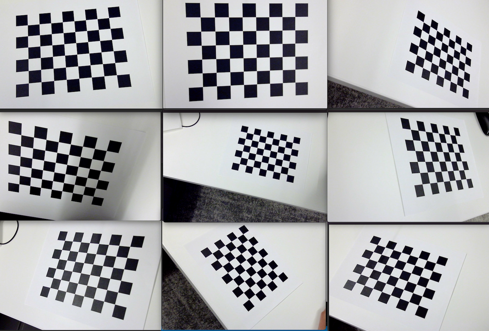

# Camera calibration
Calibrate a camera and extract the intrinsic and distortion parameters.

Original script and more info can be found [here](https://docs.opencv.org/3.0-beta/doc/py_tutorials/py_calib3d/py_calibration/py_calibration.html).

## Instructions
1. Print out the [checkerboard](./Checkerboard-A4-25mm-8x6.pdf) and attach it to a flat surface that doesn't distort the checkerboard.
2. Take images of the checkerboard with your camera from various angles and distances.
    * Save between 10 - 15 images (see examples below).
    * NOTE: In order for the calibration to be compatible with the rdk, take the images by running the camera using the [rdk](https://github.com/viamrobotics/rdk).
3. Run `python3 cameraCalib.py YOUR_PICTURES_DIRECTORY`
4. Copy-paste the `intrinsic_parameters` and `distortion_parameters` into your rdk config.

### Example images


### Example output
```json
"intrinsic_parameters": {
   "fx": 3347.5897730591887,
   "fy": 3357.346343504132,
   "height_px": 1716,
   "ppx": 1423.2516702442595,
   "ppy": 857.5527662715425,
   "width_px": 2572
 },
 "distortion_parameters": {
   "rk1": 0.23522578742981753,
   "rk2": -2.1964442495635335,
   "rk3": 4.901102139172379,
   "tp1": -0.0014605787360963544,
   "tp2": 0.012912997198465524
 },
 ```
